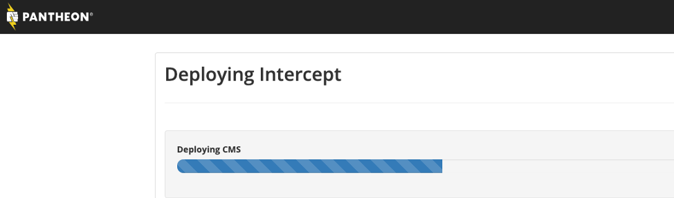
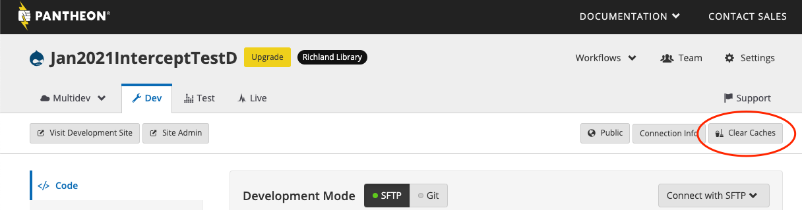
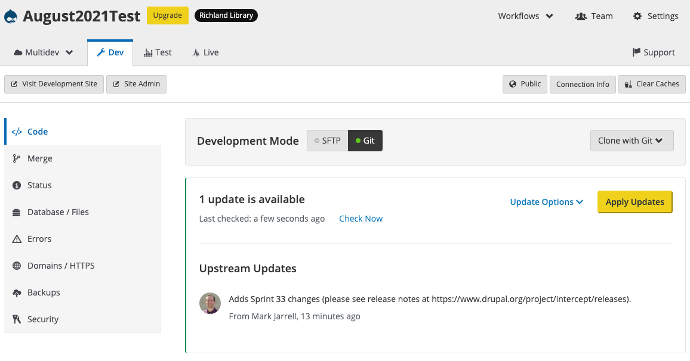

# Intercept Pantheon Upstream
Pantheon upstream for Intercept. This will install [Drupal 8](https://drupal.org/project/drupal) with the [Intercept installation profile](https://drupal.org/project/intercept_profile) which includes the [Intercept modules](https://drupal.org/project/intercept) and the [Intercept theme](https://drupal.org/project/intercept_base).  This is the quickest way to get Intercept, its theme, and its dependencies up and running on Pantheon.

## Why This Upstream Exists
Custom upstreams are a convenient way to quickly install and evaluate a new instance of Drupal 8 using Intercept without needing to worry about server requirements, upgrades, or deployment scripts.  Updates to the upstream will automatically become available to your installation on the Pantheon dashboard.

## Requirements
This upstream requires that you have a Pantheon account and the ability to create a new site using an upstream.

## Creating a Site on Pantheon With This Upstream

1. Visit https://dashboard.pantheon.io/sites/create?upstream_id=57c6a03c-45ff-4249-b708-0cef6470c599
2. Enter your site name and region and click "Continue".
<br>
You will see this notification:<br>

3. This may take a few minutes. When it is complete, click on "Visit your Pantheon Site Dashboard".
<br>
Now you have deployed your site.
4. In the Pantheon dashboard, navigate to your new site by clicking "Visit Development Site."


### Install your site
Before the next step, you should have a generic email address set up to use. This email address is the one that will send out registrations, room reservations, and reminders from the site. It should not be someone's personal or library email address.

1. Proceed through the Intercept Profile installation process.
<br>
This may take a few minutes.
2. Configure the site.<br>

3. There are two checkboxes at the bottom of this page under "Generate Demo Content":
  *	Events, Room Reservations, Locations, and Rooms
  *	Equipment

Click these if you want to pre-populate the site with generic events, locations, etc. You can always delete these later, or create a new site and delete this one.

4. We also recommend that you clear the Pantheon caches after first installing the site<br>


**Now your site is installed and it’s time to [configure the site to your individual library specifications](https://www.drupal.org/docs/8/modules/intercept/installation-guide#s-intercept-initial-configuration).**

## Updating Your Site at a Later Date

Updates can be applied either directly on Pantheon, by using Terminus, or on your local machine.

### Update on Pantheon

When an update has been released for the upstream, you should have the ability to apply the update directly on the Pantheon dashboard. It will look like this:


### Update With Terminus

Install [Terminus 2](https://pantheon.io/docs/terminus/) and the [Terminus Composer plugin](https://github.com/pantheon-systems/terminus-composer-plugin).  Then, to update your site, ensure it is in SFTP mode, and then run:
```
terminus composer <sitename>.<dev> update
```
Other commands will work as well; for example, you may install new modules using `terminus composer <sitename>.<dev> require drupal/pathauto`.

### Update on Your Local Machine

You may also place your site in Git mode, clone it locally, and then run composer commands from there.  Commit and push your files back up to Pantheon as usual.
